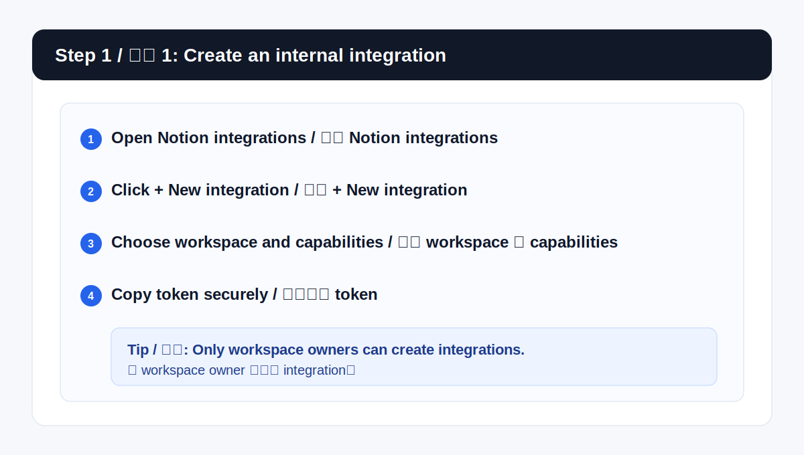
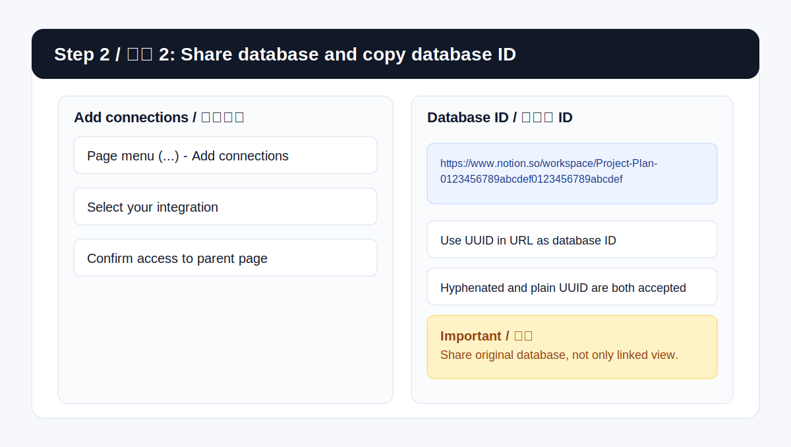
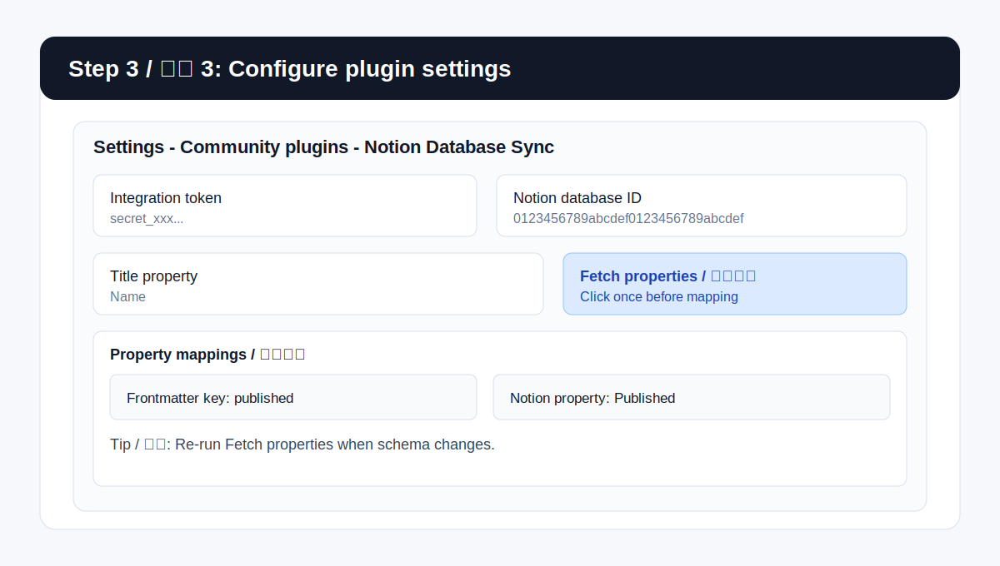

# Notion Database Sync

[English](README.md)

## 概览

Notion Database Sync 是一个 Obsidian 社区插件，用来把当前 Markdown 笔记与指定的 Notion 数据库同步。

它当前聚焦在一个可观察、可诊断的手动工作流上：

- 把当前笔记推送到 Notion
- 把已关联的 Notion 页面拉回当前笔记
- 同步 frontmatter 与 Notion 属性映射
- 用固定 frontmatter 字段 `notionPageId` 保存关联的页面 ID

如果只配置了一个数据库，插件会直接使用它；如果配置了多个数据库，插件会先让你选择目标数据库。

## 当前功能

- 手动将当前笔记从 Obsidian 同步到 Notion
- 手动将当前笔记从 Notion 拉回 Obsidian
- 支持 frontmatter 键与 Notion 属性的映射
- 支持一键拉取目标 Notion 数据库的属性列表
- 设置页里的 Notion 属性使用下拉框选择，不需要手动输入
- 同步时会先显示进行中提示，失败时也会给出更明确的错误信息
- UI 文案支持英文和简体中文，跟随 Obsidian 当前语言

## 支持的属性类型

当前已支持读写的 Notion 属性类型：

- `title`
- `rich_text`
- `number`
- `checkbox`
- `url`
- `email`
- `phone_number`
- `date`
- `select`
- `multi_select`
- `status`

以下只读或暂不支持回写的属性类型不会写回 Notion：

- `created_by`
- `created_time`
- `last_edited_by`
- `last_edited_time`
- `formula`
- `rollup`
- `unique_id`
- `verification`
- `button`

## 配置步骤

1. 在 Notion 中创建 internal integration。
   打开 Notion integrations 页面，点击 `+ New integration`，选择工作区并创建 internal integration。只有该工作区的 workspace owner 才能创建 integration。
2. 为 integration 打开合适的 capabilities。
   这个插件需要访问数据库内容。实际配置上，至少应允许读取内容，以及写入或插入内容，这样插件才能读取页面、更新页面和创建页面。
3. 在 integration 配置页复制 token。
   这个 token 是密钥，不要提交到代码仓库，也不要在截图里暴露。
4. 把目标数据库所在的页面或数据库共享给这个 integration。
   在 Notion 中打开包含数据库的页面，点击右上角 `...`，选择 `Add connections`，再选中你的 integration。即使 token 正确，如果 integration 没有访问父页面，API 调用也会失败。
5. 找到 Notion 数据库 ID。
   把数据库作为整页打开，复制链接，从 URL 中提取 UUID。带连字符和不带连字符的写法都可以，这个插件支持直接粘贴数据库 ID。
6. 构建或安装插件到 `<Vault>/.obsidian/plugins/notion-database-sync/`。
7. 打开 **Settings → Community plugins → Notion Database Sync**。
8. 填入 integration token。
9. 添加一个数据库配置。
10. 填写以下信息：
   - 配置名称
   - Notion 数据库 ID
   - 标题属性
11. 点击一次 **Fetch properties / 拉取属性**。
   这一步会读取远端数据库 schema，并把可用属性名缓存到映射下拉框里。
12. 在属性映射表中填写 frontmatter 键，并从下拉框选择对应的 Notion 属性。

## 配置截图示例

以下图片是与插件流程一致的配置示意图。

1. 创建 internal integration
   
2. 通过 Add connections 共享数据库并复制数据库 ID
   
3. 在插件设置中填写并点击拉取属性
   

## Notion 相关说明

- Notion 在 API 里会把很多数据库容器称为 data source，但插件里仍然使用“数据库 ID”这个说法，因为这更符合大多数用户在 Notion 里的查找方式。
- 如果映射的属性依赖 relation，相关数据库也可能需要共享给同一个 integration，否则 Notion 返回的 schema 里可能缺少这些属性。
- Linked database 不是 API 的独立真实来源。应该共享原始数据库，而不是只共享一个 linked view。

## 使用方式

- 使用侧边栏按钮或命令 **Sync active note database**，把当前笔记推送到 Notion。
- 使用命令 **Pull active note from Notion**，把已关联的 Notion 页面内容和映射属性拉回当前笔记。
- 首次同步时，插件会创建 Notion 页面，并把 `notionPageId` 写入笔记 frontmatter。

## 排查问题

- 出现 `Failed to fetch`，通常表示 integration token 无效、目标页面或数据库没有共享给 integration，或者数据库 ID 填错了。
- 如果 **Fetch properties / 拉取属性** 没拿到有效结果，先确认你共享的是原始数据库，而不只是 linked database 视图。
- 如果 relation 相关属性缺失，把关联数据库也共享给同一个 integration。
- 如果页面能创建或更新，但属性映射结果不对，先对照远端 schema 检查映射名称，再重新执行一次 **Fetch properties / 拉取属性**。

## 当前行为说明

- 插件当前聚焦在“当前笔记”工作流，没有暴露批量“同步所有数据库”的命令。
- `notionPageId` 是内置 frontmatter 字段，不在设置页中开放配置。
- 属性类型来自远端 Notion 数据库 schema，不会只根据 frontmatter 值自动猜测类型。

## 开发

```bash
npm install
npm run build
npm test
npm run build:release
```

测试覆盖率阈值为 70%，覆盖行、语句、函数和分支。

## 发布

Release 资产包括：

- `main.js`
- `manifest.json`
- `styles.css`
- `<插件 ID>-<版本号>.zip`

构建命令：

```bash
npm run build:release
```

当前版本说明：

- [1.0.2 发布说明](docs/releases/1.0.2.md)
- [1.0.1 发布说明](docs/releases/1.0.1.md)
- [1.0.0 发布说明](docs/releases/1.0.0.md)

仓库内置了 [.github/workflows/release.yml](.github/workflows/release.yml)，推送类似 `1.0.2` 的 SemVer tag 时会自动发布 `release/*`。

## Notion 官方参考

- Internal integration setup: https://developers.notion.com/guides/get-started/authorization
- Create an integration: https://developers.notion.com/docs/create-a-notion-integration
- Authentication: https://developers.notion.com/reference/authentication
- Retrieve a database: https://developers.notion.com/reference/retrieve-a-database
- Working with databases and data sources: https://developers.notion.com/docs/working-with-databases
- Notion Help Center overview: https://www.notion.com/help/create-integrations-with-the-notion-api
